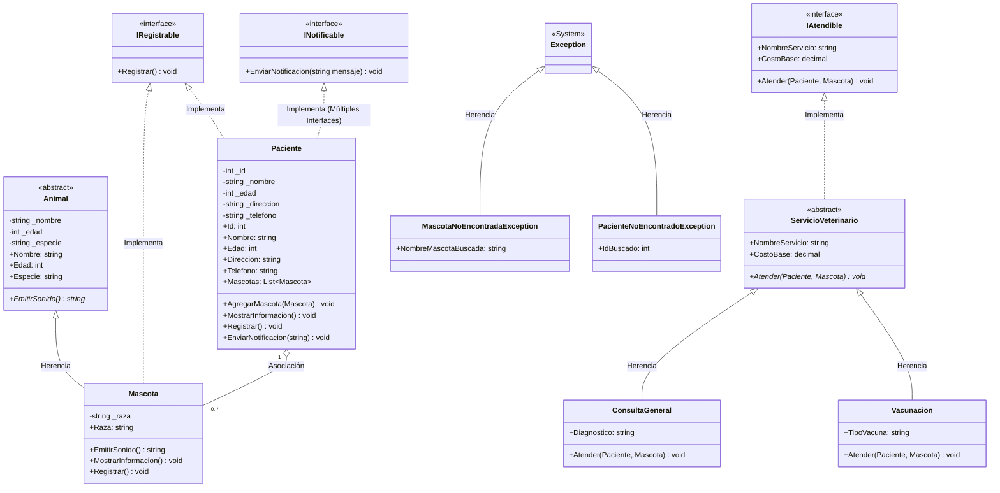

# Clínica Veterinaria Salud+ (Semana 4)

Aplicación de consola en .NET enfocada en interfaces múltiples, manejo estructurado de excepciones, depuración y sistema de logging.

## Diagrama de Clases UML (Actualizado Semana 4)

## Novedades y Decisiones de Diseño

### 1. Interfaces vs Clases Abstractas
- `IRegistrable`: Contrato uniforme para persistencia en consola/memoria (`Paciente` y `Mascota`).
- `INotificable`: Contrato de comunicación implementado en `Paciente`.
- `IAtendible`: Contrato desacoplado para servicios veterinarios.
- `Paciente` implementa **múltiples interfaces** (`IRegistrable` e `INotificable`).
- `ServicioVeterinario` combina clase base abstracta con la interfaz `IAtendible` para compartir estado (`CostoBase`, `NombreServicio`).

### 2. Manejo de Excepciones y Logging
- Excepciones de dominio: `MascotaNoEncontradaException` y `PacienteNoEncontradoException`.
- Bloques `try-catch-finally` en todas las operaciones.
- `LoggerService`: Registro persistente de errores en el archivo `clinica_errores.log` con fecha/hora y traza de error.
