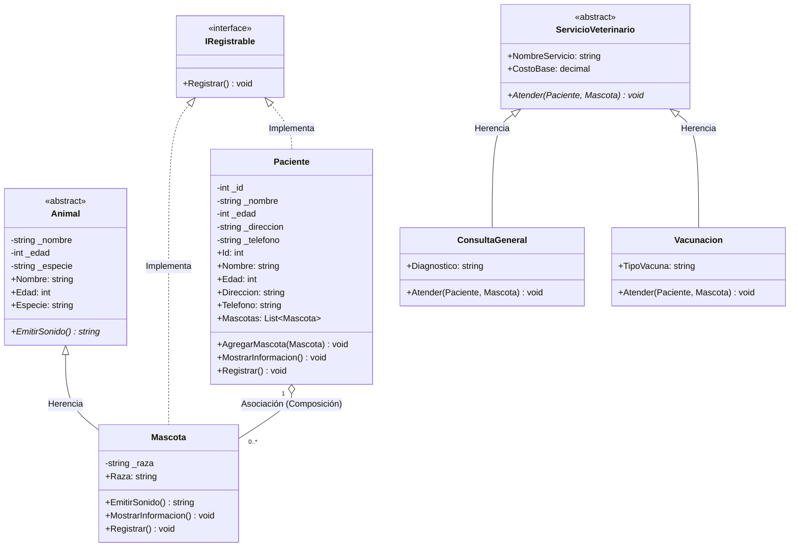

# Clínica Veterinaria Salud+ (Semana 3)

Aplicación de consola en .NET enfocada en Programación Orientada a Objetos (POO), Herencia, Polimorfismo, Encapsulación, Abstracción y Diseño UML.

## Diagrama de Clases UML

## Conceptos de POO Aplicados
- **Encapsulación:** Atributos privados con propiedades públicas validadas.
- **Herencia:** `Mascota` hereda de la clase base `Animal`. `ConsultaGeneral` y `Vacunacion` heredan de `ServicioVeterinario`.
- **Polimorfismo:** Sobrescritura de `EmitirSonido()` en `Mascota` y `Atender()` en servicios veterinarios.
- **Abstracción:** Clases abstractas `Animal`, `ServicioVeterinario` e interfaz `IRegistrable`.
- **Relaciones:** Asociación 1 a N (`Paciente` puede tener múltiples `Mascota`).
