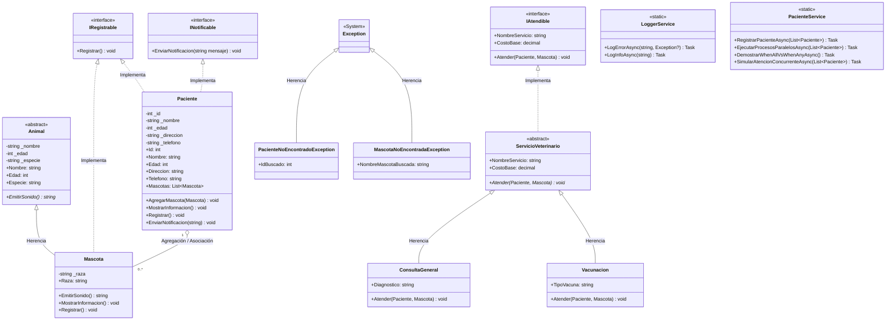

# Clínica Veterinaria Salud+ (Semana 5)

Aplicación de consola en .NET enfocada en programación asíncrona (`async`/`await`), gestión concurrente con `Task` (`Task.WhenAll`, `Task.WhenAny`), manejo de excepciones de dominio y convenciones de codificación de C#.

## Diagrama de Arquitectura de Clases UML

## Fundamentos y Buenas Prácticas Asíncronas

### 1. `async` / `await`
- Permite liberar el hilo de ejecución principal durante operaciones de entrada/salida (*I/O-bound*) simuladas con `Task.Delay` o persistencia asíncrona de archivos (`File.AppendAllTextAsync`).

### 2. Gestión de Tareas Paralelas
- **`Task.WhenAll`**: Ejecuta múltiples tareas independientes en paralelo (carga de historial médico, agendamiento de cita y envío de SMS), reduciendo drásticamente el tiempo total de respuesta.
- **`Task.WhenAny`**: Permite reaccionar al primer resultado disponible entre múltiples servicios asíncronos en competencia (ejemplo: respuesta más rápida de laboratorios).

### 3. Buenas Prácticas y Convenciones de C#
- **Cero bloqueos síncronos:** No se utiliza `.Result` ni `.Wait()`, evitando bloqueos del hilo principal (*deadlocks*).
- **Sufijo `Async`:** Todos los métodos asíncronos llevan el sufijo correspondiente (`RegistrarPacienteAsync`, `LogErrorAsync`).
- **Nomenclatura uniforme:**
  - `PascalCase` para clases, métodos e interfaces.
  - `camelCase` para variables y parámetros.
  - `_camelCase` para atributos privados.
